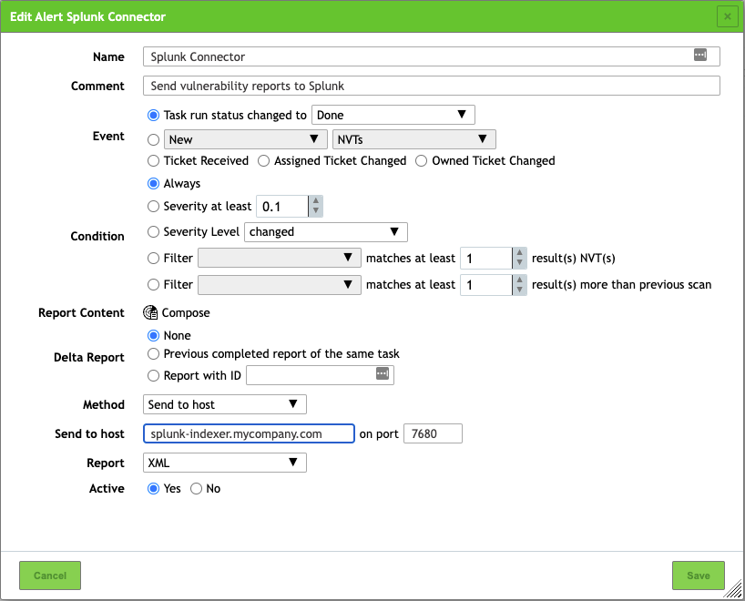
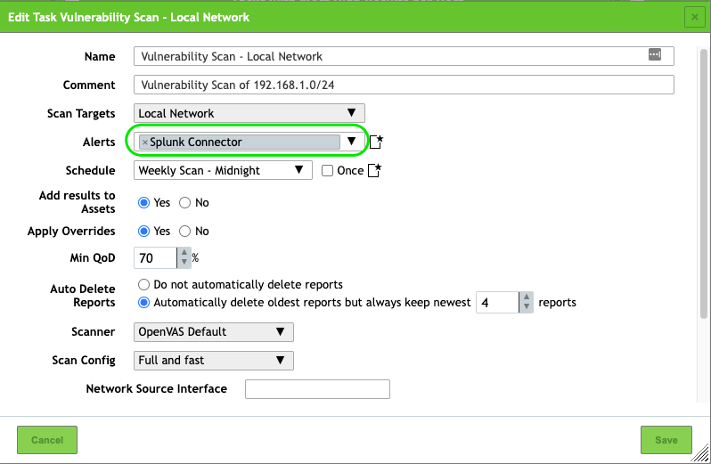
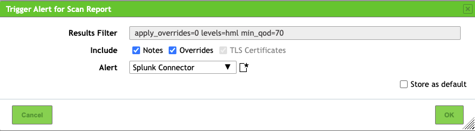
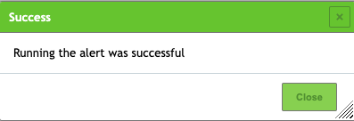
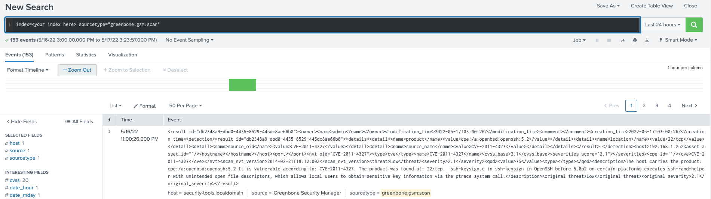

# Greenbone Vulnerability Manager Add-on for Splunk

## Overview

### About the Greenbone Vulnerability Manager Add-on for Splunk

|                       |                                                         |
|-----------------------|---------------------------------------------------------|
| Version               | 1.0.1                                                   |
| Vendor Products       | Greenbone Community Edition (GCE). Others are untested. |
| Visible in Splunk Web | No.                                                     |

The **Greenbone Vulnerability Manager Add-on for Splunk** collects vulnerability scan and operational log data from Greenbone Vulnerability Manager (GVM). You can install the Add-on on a forwarder to send data from GVM to a Splunk Enterprise indexer or group of indexers. You can also use the add-on to provide data for other apps, such as Splunk Enterprise Security.

The **Greenbone Vulnerability Manager Add-on for Splunk** collects the following data using file inputs:

- Vulnerability Scan results sent from GVM to Splunk as scan tasks are completed.
- Changes to various GVM services log files in the `/var/log/gvm` directory and subdirectories.

### Source types for the Greenbone Vulnerability Manager Add-on for Splunk

The **Greenbone Vulnerability Manager Add-on for Splunk** provides index-time, search-time and CIM normalization for GVM vulnerability scan results, authentication, tasks and operational data in the following formats:

| Source Type                | Description                                             | CIM Data Models    |
|----------------------------|---------------------------------------------------------|--------------------|
| greenbone:gsm:scan         | Vulnerability Scan Results (parsed from XML)            | Vulnerabilities    |
| greenbone:gsad:log         | Greenbone Security Assistant (GSA) logs                 | Authentication     |
| greenbone:gvmd:log         | Greenbone Vulnerability Manager Daemon (GVMD) logs      | Change             |
| greenbone:openvas:log      | OpenVAS Scanner logs                                    | n/a                |
| greenbone:ospd-openvas:log | OSP Daemon Scanner logs                                 | n/a                |

### Compatibility

This version of the add-on is compatible with the following platform, OS and CIM versions:

|                                  |                      |
|----------------------------------|----------------------|
| Splunk Platform                  | 8.x and later        |
| CIM                              | 4.2 and later        |
| Supported OS for data collection | Any supported by GCE |

## Installation

### Install the Greenbone Vulnerability Manager Add-on for Splunk

You can install the **Greenbone Vulnerability Manager Add-on for Splunk** with Splunk Web or from the command line. You can install the add-on onto any type of Splunk Enterprise instance (indexer, search head, or forwarder).

1. Download the add-on from [Github](https://github.com/ccloutier-splunk/TA-gvm/releases) or alternatively clone the project using your `git` client.
2. Determine where and how to install this add-on in your deployment.
3. Perform any prerequisite steps before installing.
4. Complete your installation.

See Installing add-ons in Splunk Add-Ons for detailed instructions describing how to install a Splunk add-on in the following deployment scenarios:

- [Single-instance Splunk Enterprise](http://docs.splunk.com/Documentation/AddOns/released/Overview/Singleserverinstall)
- [Distributed Splunk Enterprise](http://docs.splunk.com/Documentation/AddOns/released/Overview/Distributedinstall)

### Distributed installation of this add-on

Use the tables below to determine where and how to install this add-on in a distributed deployment of Splunk Enterprise or any deployment for which you are using forwarders to get your data in. Depending on your environment, your preferences, and the requirements of the add-on, you may need to install the add-on in multiple places.

| Splunk instance type | Supported | Required    | Comments                                                                                      |
|----------------------|-----------|-------------|-----------------------------------------------------------------------------------------------|
| Search Heads         | Yes       | Yes         | Install this add-on to all search heads where GVM knowledge management is required.           |
| Indexers             | Yes       | Yes         | Install this add-on to all indexers, it has index-time configurations.                        |
| Heavy Forwarders     | Yes       | Conditional | Required if you have Heavy Forwarders in your ingestion path or they perform data collection. |
| Universal Forwarders | Yes       | Recommended | Install this add-on to the Universal Forwarders installed on your GVM hosts to collect data.  |

### Distributed deployment compatibility

This table provides a quick reference for the compatibility of this add-on with Splunk distributed deployment features.

| Distributed deployment feature | Supported | Comments                                                         |
|--------------------------------|-----------|------------------------------------------------------------------|
| Search Head Clusters           | Yes       | N/A                                                              |
| Indexer Clusters               | Yes       | N/A                                                              |
| Deployment Server              | Yes       | Supported for deploying the configured add-on to multiple nodes. |


## Configuration

### Enable data and scripted inputs for the Greenbone Vulnerability Manager Add-on for Splunk

After you have installed the **Greenbone Vulnerability Manager Add-on for Splunk**, you must enable the data and network inputs within the add-on so that it collects data from your GVM environment.
You must enable the inputs using the configuration files.

> Note: When you configure data and scripted inputs using configuration files, copy only the input stanzas whose configurations you want to change. Do not copy the entire file, as those changes persist even after an upgrade.

1. Create `inputs.conf` in the `$SPLUNK_HOME/etc/apps/TA-gvm/local` directory.
2. Open `$SPLUNK_HOME/etc/apps/TA-gvm/local/inputs.conf` for editing.
3. Open `$SPLUNK_HOME/etc/apps/TA-gvm/default/inputs.conf` for editing.
4. Copy the input stanza text that you want to enable from the `$SPLUNK_HOME/etc/apps/TA-gvm/default/inputs.conf` file and paste them into the `$SPLUNK_HOME/etc/apps/TA-gvm/local/inputs.conf` file.
5. In the `$SPLUNK_HOME/etc/apps/TA-gvm/local/inputs.conf` file, enable the inputs that you want the add-on to monitor by setting the `disabled` attribute for each input stanza to `0` or alternatively removing it completely (the default is "enabled").
6. Save the `$SPLUNK_HOME/etc/apps/TA-gvm/local/inputs.conf` file.
7. Restart the Splunk enterprise instance.

The recommended approach is to deploy the **configured** add-on to the relevant nodes using a **Deployment Server**.  

### (Optional) Configure the Greenbone Vulnerability Manager Add-on for Splunk to send data to another index

You can (and likely should in most cases) send the collected data to a dedicated Splunk index.  
This can be achieved by creating the relevant index on your indexers and then adding:

```
index = myindexofchoice
```

... to the relevant input configuration stanza.  So if you wanted to send your Vulnerability scan data to an index named `vuln`, your configuration would look like this:

```
[tcp://7680]
source = Greenbone Security Manager
sourcetype = greenbone:gsm:scan
disabled = 0
index = vuln
```
> Note: This works for all input stanzas, i.e. `monitor` inputs.

### Enable the TCP input for Vulnerability Scan Data

Use the provided input stanza to enable the TCP input on your indexers by deploying the **configured** stanza to your indexers.

Alternatively, configure the TCP input using Splunk Web on your indexers:

1. Log into Splunk Web on your indexer node.
2. Navigate to **Settings** > **Data inputs**.
3. Click **+ Add New** next to **TCP**.
4. Enter the desired TCP port in the "Port" field (suggested: `7680`).
5. Enter the following value for **Source name override**: `Greenbone Security Manager`
6. Optionally, enter allowed GVM hosts as the value for "Only accept connection from".
7. Click **Next**.
8. Set the **Source type** as `greenbone:gsm:scan`.
9. Optionally, select your preferred index instead of `Default`.
10. Review and save your TCP Input configuration.

### Enable sending Scan Results from Greenbone Vulnerability Manager.

In order for Greenbone Vulnerability Manager to send the results of a Vulnerability Scan Task, perform the following:

1. Log in to your **Greenbone Security Assistant** instance using admin-level credentials and your favorite Web Browser.
2. Navigate to **Configuration** > **Alerts**.
3. Click the   icon to add a new **Alert** configuration.
4. Configure the **Alert** as follows:

5. Make sure to:
	+ Use the `Send to host` **Method**
	+ Change the value of **Send to host** to your Splunk instance (Indexer or Heavy Forwarder) where you configured the TCP Data Input.
	+ Change the value of **On port** to the proper TCP port number if you didn't use the default of `7680`.
	+ Use `XML` as the value for **Report**.  Other formats are not supported.
	+ Make sure **Active** is set to `Yes`.
6. Save your Alert configuration.

Now that you have a proper Alert configuration to send results to Splunk, you need to use it in the relevant Scan Tasks.

1. Navigate to **Scans** > **Tasks**.
2. Click on  next to a Scan Task.
3. Select the Alert Configuration you just created in the **Alerts** dropdown. For example:

4. Save your changes.

Testing your Alert can be done as follows:

1. Navigate to **Scans** > **Reports**.
2. Click on the date of a previously completed report (run one if needed).
3. Click on .
4. Select the alert you created in the drop-down list **Alert**:

5. Click **OK**.
6. After a few seconds, you should get a confirmation that the Alert successfully sent data:

7. You can now confirm the data is in your Splunk environment:


This is also available in the Greenbone official documentation [here](https://docs.greenbone.net/GSM-Manual/gos-21.04/en/connecting-other-systems.html#configuring-a-splunk-alert).

## Troubleshooting

### General troubleshooting

For troubleshooting tips that you can apply to all add-ons, see [Troubleshoot add-ons](http://docs.splunk.com/Documentation/AddOns/released/Overview/Troubleshootadd-ons) in Splunk Add-ons.

### Missing Vulnerability Scan data

If no data is received from your GVM scans, check the following:

1. Your TCP Data Input is properly configured on your relevant Splunk instance and listens for incoming data (Use `./splunk list tcp` and/or `netstat`).
2. Your Greenbone Security Assistant instance can reach your Splunk indexer/Heavy Forwarder where the TCP Input is configured over the selected TCP Port (firewall rules opened - `telnet` is your friend).
3. Your Alert is properly configured to send Vulnerability scan data from your GSA instance to your Splunk environment.
4. Review the `/var/log/gvm/gvmd.log` logs on the GSA side as well as the internal Splunk logs for errors.
	+ The GVM Daemon should report a similar message on a successful test: `event alert:MESSAGE:2022-05-17 15h20.29 EDT:899979: The alert Splunk Connector was triggered (Event: Task status changed to 'Done', Condition: Always)` 

## Credits, References & Notes

This add-on was loosely based on the original [App](https://download.greenbone.net/tools/Greenbone-Splunk-App-1.0.1.tar.gz) built by Greenbone Networks GmbH which is documented [here](https://docs.greenbone.net/GSM-Manual/gos-21.04/en/connecting-other-systems.html#setting-up-the-greenbone-splunk-app).

 “Greenbone” is a trademark of Greenbone Networks GmbH and they are in no way affiliated with this work.  Any rights, title and interest in these trademarks remains solely with them.

> Author: Christian Cloutier <ccloutier@splunk.com>